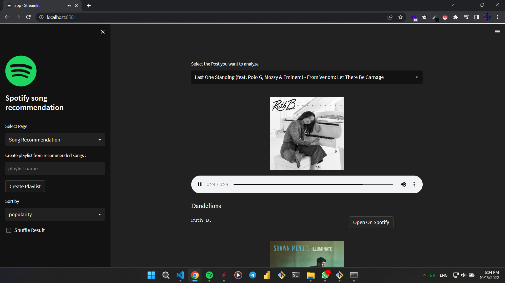
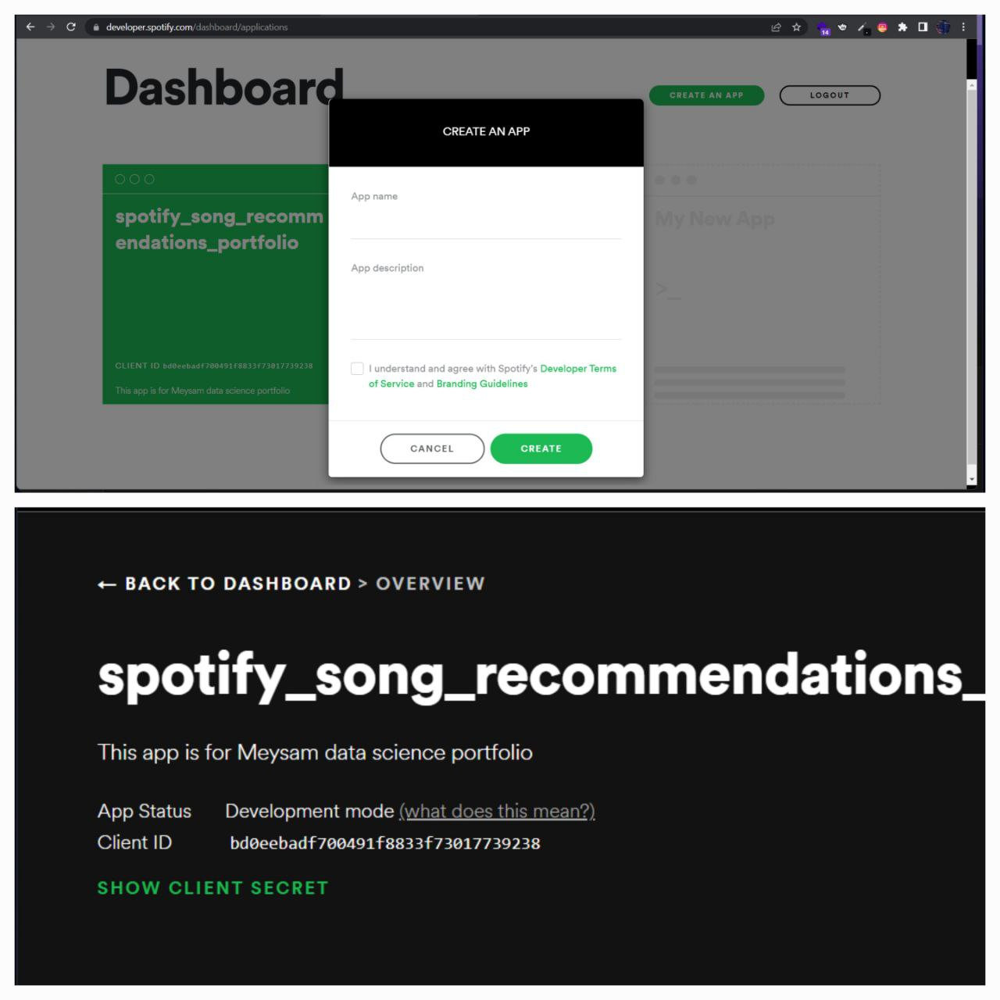

# Spotify Recommendation System App End To End Project

In this project, using the data I collected from Spotify (audio streaming and media services provider), I tried to make a recommendation system that based on audio feature, song genre, artist, etc., the song we choose gives us Suggest songs

Watch Demo here : 
https://spotify-song-recommendation.herokuapp.com/

# Spotify end to end recommendation system project
In this project, I am trying to create a **content base recommendation system** using the data I collect from Spotify. To build this system, I use the data of my favorite songs and the songs between **2017** and **2022**.

# Project Overview :

## 1 - Setup Spotify Api 
- Open [spotify developers](https://developer.spotify.com/dashboard/login) go to ***dashboard*** - create app and get your ***client id*** and ***secret id***

## 2 - Collecting Data
- Collect songs between 2017 and 2022
- Collect songs that i liked
- Collect audio features of collected songs 
- Collect audio features of liked songs
- Merge songs and their audio features
- Save data into a csv file

## 3 - Understand the data
- Shape of the data
- Check column dtypes
- Check is there any null values
- Check the correlation

## 4 - Cleaning the data 
- Drop "album genres" column
- Convert artist genres to str

## 5 - Analyzing Data
- Number of songs per year
- Songs duration distribution and (min,avg,max) 
- Song popularity distribution and (min,avg,mode,max)
- Artist genres wordcolud 
- Analyzing audio features
