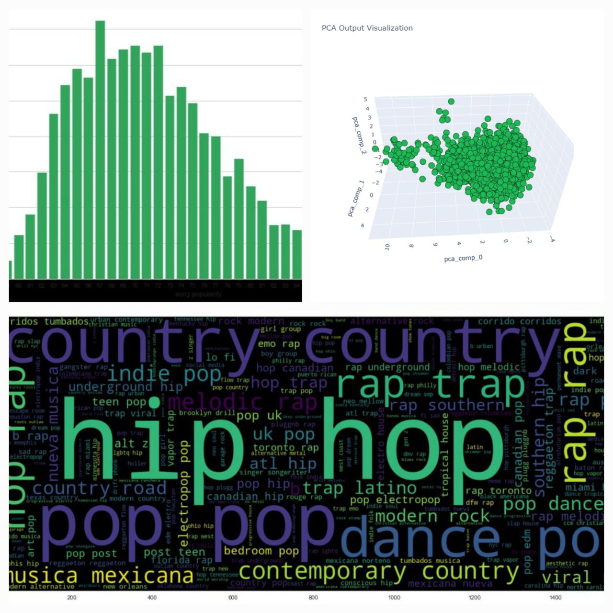
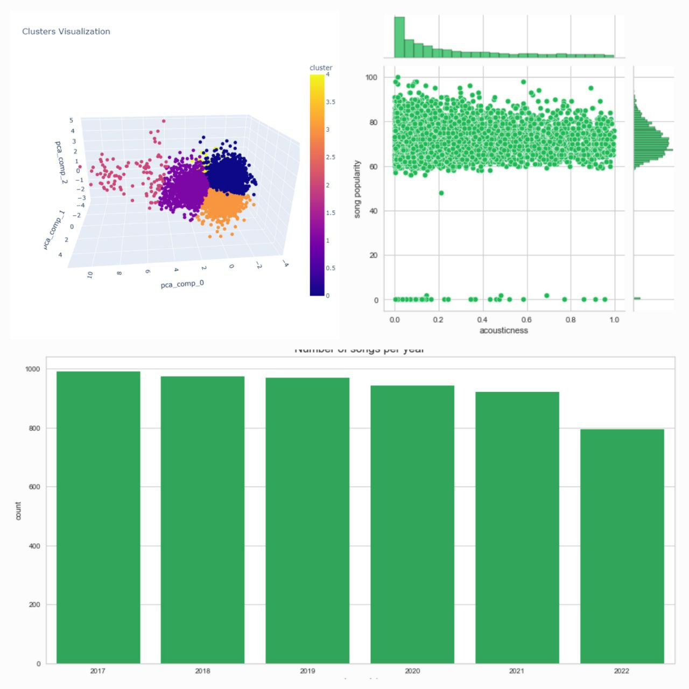

# Spotify Recommendation System App End To End Project

In this project, using the data I collected from Spotify (audio streaming and media services provider), I tried to make a recommendation system that based on audio feature, song genre, artist, etc., the song we choose gives us Suggest songs

Watch Demo here : 
https://spotify-song-recommendation.herokuapp.com/

# Spotify end to end recommendation system project
In this project, I am trying to create a **content base recommendation system** using the data I collect from Spotify. To build this system, I use the data of my favorite songs and the songs between **2017** and **2022**.

# Project Overview :

## 1 - Setup Spotify Api 
- Open [spotify developers](https://developer.spotify.com/dashboard/login) go to ***dashboard*** - ***create app*** and get your ***client id*** and ***secret id***

## 2 - Collecting Data

- ### Collect songs between 2017 and 2022 (1000 each year)

- ### Collect songs that i liked

- ### Collect audio features of collected songs 
    - Danceability: Danceability describes how suitable a track is for dancing based on a combination of musical elements including tempo, rhythm stability, beat strength, and overall regularity. A value of 0.0 is least danceable and 1.0 is most danceable.
    - Acousticness: A measure from 0.0 to 1.0 of whether the track is acoustic.
    - Energy: Energy is a measure from 0.0 to 1.0 and represents a perceptual measure of intensity and activity. Typically, energetic tracks feel fast, loud, and noisy.
    - Instrumentalness: Predicts whether a track contains no vocals. The closer the instrumentalness value is to 1.0, the greater likelihood the track contains no vocal content.
    - Liveness: Detects the presence of an audience in the recording. Higher liveness values represent an increased probability that the track was performed live.
    - Loudness: The overall loudness of a track in decibels (dB). Loudness values are averaged across the entire track. Values typical range between -60 and 0 db.
    - Speechiness: Speechiness detects the presence of spoken words in a track. The more exclusively speech-like the recording (e.g. talk show, audio book, poetry), the closer to 1.0 the attribute value.
    - Tempo: The overall estimated tempo of a track in beats per minute (BPM). In musical terminology, tempo is the speed or pace of a given piece and derives directly from the average beat duration.
    - Valence: A measure from 0.0 to 1.0 describing the musical positiveness conveyed by a track. Tracks with high valence sound more positive (e.g. happy, cheerful, euphoric), while tracks with low valence sound more negative (e.g. sad, depressed, angry).

- ### Collect audio features of liked songs

- ### Merge songs and their audio features

- ### Save data into a csv file

## 3 - Understand the data

- ### Shape of the data
- ### Check column dtypes
- ### Check is there any null values
- ### Check the correlation

## 4 - Cleaning the data 

- ### Drop "album genres" column
- ### Convert artist genres to str

## 5 - Analyzing Data

- ### Number of songs per year
- ### Songs duration distribution and (min,avg,max) 
- ### Song popularity distribution and (min,avg,mode,max)
- ### Artist genres wordcolud 
- ### Analyzing audio features

## 6 - Apply Dmensionality Reduction

- ### Split audio features from data
- ### Standard Scaling Audio Features
- ### Apply PCA
- ### Put PCA Output Into a Dataframe
- ### Visualize reduced dimension Data

## 7 - Apply Clustering

- ### Select the right value of k for clustring
- ### Fit reduced dimension data into Kmeans
- ### Visualize clusterd data (kemans output)

## 8 - Create Recommendation System

